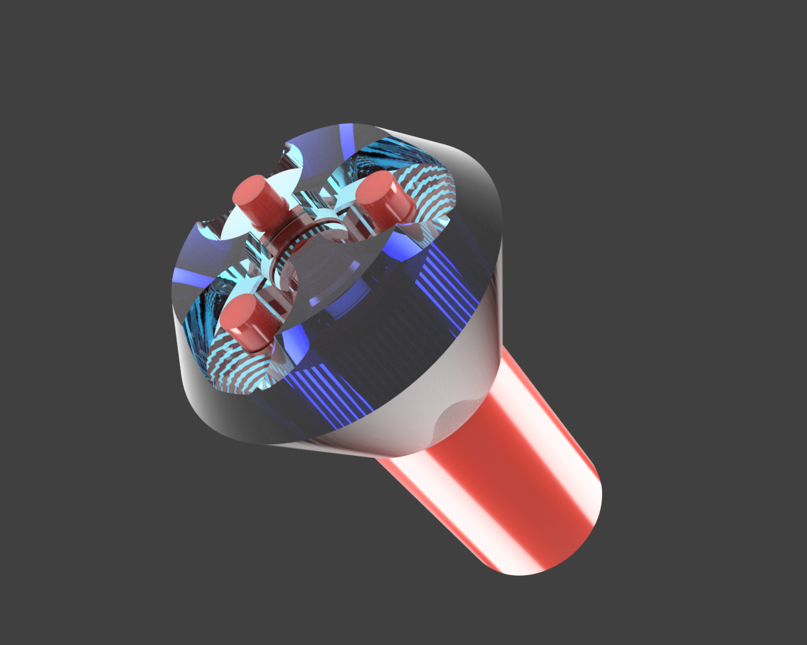

# Conical One

A conical adapter for the i3 MK2's filament arms. This lets MK2 users mount spools with asymmetric sides, or spools with odd inner core diameters (compatible with spools with a ~> 38mm inner core diameter). 

# Materials needed

3D printer, filament.

### Optional

6x 608 skateboard bearings (3 for each holder). [Bones Reds](https://www.amazon.com/Bones-Bearings-Reds/dp/B003U7TQ5U) have been tested with this adapter and work reasonably well.

# Printing

Use ConicalPlatedForPrinting.stl to 3D print. The individual objects are available as well.

# Installation

When mounting a spool, the arms might snag slightly on the sides if the arms are spaced too tightly. Post installation, give it a spin to test and adjust as needed with the spool mounted.
